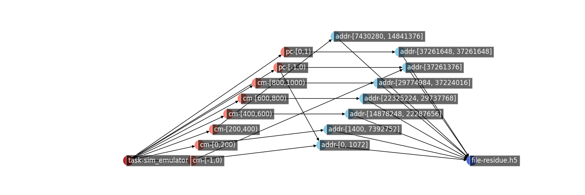
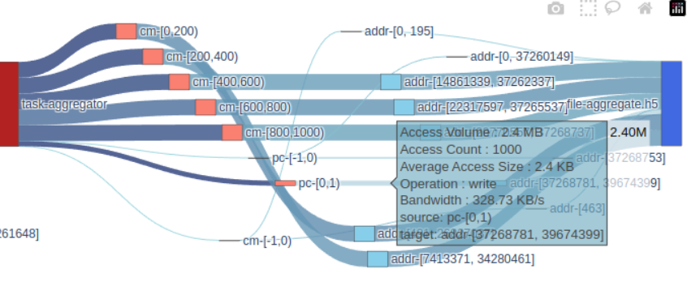

# Example Sankey Diagram of Data Lifecycle in Workflow
Traces are generaged by using HDF5 passthrough-VOL and Hermes VFD adaptor. Recorded as log files, then being transformed into csv files for analysis.\
Logging process shell be improved in the future.

## Producer-Consumer
The producer and consumer program is the sim_emulator.py and aggregator.py programs. Simplified as SIM and AGG below.

## List of Sankey Data Lifecycle Graphs
### Detailed Graphs 
Located in the ./detailed_graph folder:
- [Sampled detailed SIM](https://htmlpreview.github.io/?https://github.com/candiceT233/local-co-scheduling/blob/sankey-graph/sankey_diagram/detailed_graph/sankey-sampled-sim_w-vol-vfd-.html)
- [Sampled detailed AGG](https://htmlpreview.github.io/?https://github.com/candiceT233/local-co-scheduling/blob/sankey-graph/sankey_diagram/detailed_graph/sankey-sampled-agg-vol-vfd.html)
    - Note that the aggregation workflow, the task-aggregator node is not respecting the assigned [x,y] position of the graph
- [Sampled detailed SIM-AGG](https://htmlpreview.github.io/?https://github.com/candiceT233/local-co-scheduling/blob/sankey-graph/sankey_diagram/detailed_graph/sankey-sampled-agg-vol-vfd.html)

### Grouped Graphs
These are graphs grouping the small I/O accesses into larger groups. \
Located in the ./group_graph folder:
- [Grouped SIM](https://htmlpreview.github.io/?https://github.com/candiceT233/local-co-scheduling/blob/sankey-graph/sankey_diagram/group_graph/sankey-grouped-sim-vol-vfd-.html)
- [Grouped AGG](https://htmlpreview.github.io/?https://github.com/candiceT233/local-co-scheduling/blob/sankey-graph/sankey_diagram/group_graph/sankey-grouped-agg-vol-vfd.html)
    - Note that the aggregation workflow, the task-aggregator node is not respecting the assigned [x,y] position of the graph
- [Grouped SIM-AGG](https://htmlpreview.github.io/?https://github.com/candiceT233/local-co-scheduling/blob/sankey-graph/sankey_diagram/group_graph/sankey-grouped-sim_agg-vol-vfd.html)

### Notation Explained
#### Label Expalined

The sim_emulator.py (represented as `task-sim_emulator` in red) writes two datasets, contact map (cm) and point cloud (pc). The ouput file is in blue. \
Orange vertices are the data access unit recorded from the HDF5 passthrough-VOL. `cm-[0,200)` means it is contact map dataset data access with index 0 to 199, not including 200. The dataset point cloud is only written once from the VOL layer. \
Blue vertices are the POSIX layer I/O corresponds to the data access issued in VOL. The label `addr-[0,1072]` means these I/O corresponds to the file address location with starting address between 0 and 1072 (including 1072). This region is only the starting address, not indicating the I/O size.

#### Data Lifecycle Diagram Explained

On the data lifecycle diagram, data access size is showned when hover over the edges. The  purple edges means write operation, pink edges means read operation. The edge width corresponds to the data access volumn. The shades of light/dark indicates the bandwidth, with lighter color less bandwidth, and darker color higher bandwidth. \
Since the POSIX label does not indicate the I/O operation cound, we can tell with the different lightness of the edges that there are usually more I/O operations in POSIX compared to the data access from VOL.

### Note
Prefix this linke `https://htmlpreview.github.io/?` to view HTML on GitHub.